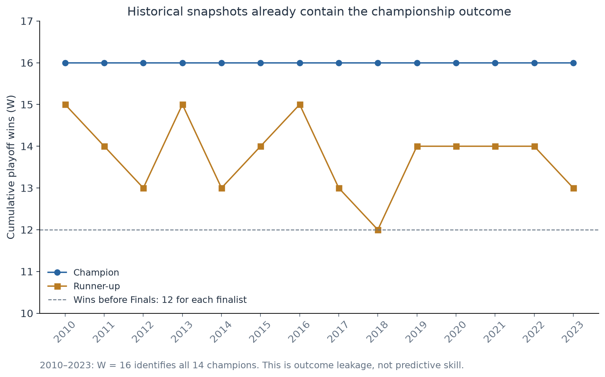
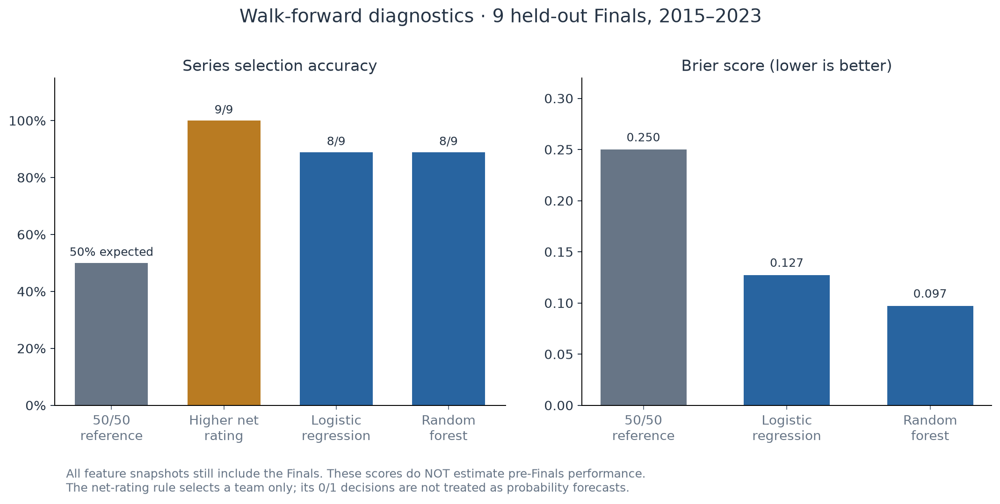
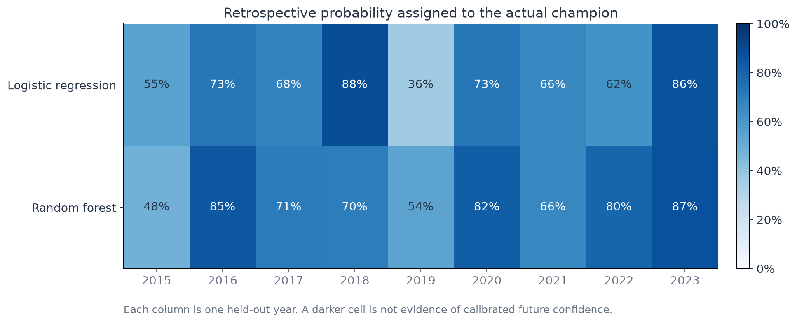
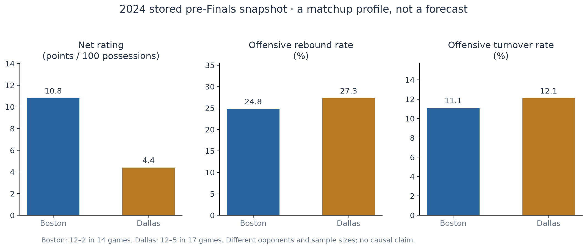

# NBA Finals Prediction：先修复数据时点，再讨论模型提升

> 研究对象：仓库内 2010–2024 年数据快照，冠军标签截至 2023 年。审计日期：2026-09-28。本文研究的是**总决赛系列赛冠军**，不是单场比赛，也不是对当前赛季的预测。

## 核心结论

- **原始结果可复现，但不能代表真实预测能力。** 原代码的 87% 交叉验证准确率、Boston 15% / Dallas 8% 输出均已复现；历史特征包含总决赛结果，2024 年未知标签又被编码为负例。
- **真正的样本量只有 14 届已知总决赛。** 修复后有 28 条已标注球队记录和 2 条未标注的 2024 年记录。原代码漏掉 2014 年，又混入 2024 年，因此表面上的行数掩盖了样本错误。
- **目前没有证据支持继续增加模型复杂度。** 在同一组 9 届逐年回测中，逻辑回归和随机森林均选对 8 届，简单净效率规则选对 9 届。这些仍是含赛后信息的回顾性诊断，不能宣传成赛前准确率。
- **本次已提升的是正确性、可复现性和报告透明度。** 真正的预测性能优化需要先补齐每一年的总决赛前快照，再重新评估。

## 1. 数据里已经藏着冠军答案



**观察：** 2010–2023 年，14 支冠军队的 `W` 全部等于 16，14 支亚军队都小于 16。只用“`W == 16`”就能正确识别全部 28 条历史球队记录。反观 2024 年快照，Boston 与 Dallas 均只有 12 场季后赛胜利，分别为 12–2、12–5。

**解释：** 历史文件是包含总决赛的季后赛累计统计，2024 年决赛队伍则处于总决赛前的比赛进度。以 2023 Denver 为例，仓库记录为 16–4、ORtg 119.5、DRtg 110.8、NRtg +8.7，与 Basketball Reference 的 [2023 季后赛汇总](https://www.basketball-reference.com/playoffs/NBA_2023.html) 搜索索引中的表格一致。本文的全量计算来自仓库 CSV；网页只作范围核对，直接页面访问返回 403，未重新抓取历史数据库。

**决策含义：** 删除 `W` 不够。`PW`、`NRtg`、投篮效率、篮板率等同样由包含总决赛的比赛计算。按年份分割可以防止训练见到未来年份，却不能让某一年的赛后统计变成赛前数据。因此，本次没有把重新计算的指标包装为真实预测提升。

## 2. 原始 87% 是怎样得到的

在原始提交 [`999dc8f`](https://github.com/jiawu123/NBA-Final-prediction/tree/999dc8f) 的函数上，仅覆盖本机数据路径，即可复现：

| 原始输出 | 本次复现 |
|---|---:|
| RFECV 选择的特征 | PW、NRtg、ORB% |
| 五折准确率 | 80%、80%、100%、100%、75% |
| 折均值 | **87%** |
| Boston 的独立分类器输出 | **15%** |
| Dallas 的独立分类器输出 | **8%** |

见 [完整原始结果复现记录](results/legacy_reproduction.json) 与 [复现脚本](../src/reproduce_legacy.py)。五折均值来自原代码的训练子集；它不是未触碰测试集的最终成绩。

| 优先级 | 发现 | 后果 | 本次处理 |
|---|---|---|---|
| P0 | 历史数据含总决赛，2024 数据不含 | 训练与使用时点不一致，存在结果泄漏 | 显式降级为回顾性诊断；不再输出可部署的 2024 冠军预测 |
| P0 | 空白 `Win_team` 与球队比较后得到 False | 2024 两队都被当作输家，并参与分割/训练流程 | 保留缺失标签，排除所有未标注系列赛 |
| P1 | 2014 advanced CSV 第一行全为空 | 真实表头被误读，合并后这一年消失 | 定位真实 `Rk,Team` 表头，恢复两支决赛队 |
| P1 | 随机拆分球队行 | 同届两队可能跨训练/测试集，且不能模拟向未来预测 | 每届一条对阵记录，严格用更早年份训练 |
| P1 | 先在完整训练子集上 RFECV，再用同一子集做 CV；预填补也先于分割 | 特征选择/预处理的评估边界不严谨 | 使用少量固定特征，填补与缩放只在每一训练折拟合 |
| P1 | 分出了测试集却没有使用 | README 的成绩缺少独立测试支持 | 输出每一测试年份的结果及训练截止年 |
| P2 | 私人绝对路径、导入即运行、无依赖声明 | 别人很难从克隆仓库复现 | 仓库相对路径、命令行入口、依赖与回归测试 |

原始数据目录共有 32 个 CSV 文件，其中 31 个是规范输入，另一个 `per100_stats_2016 (1).csv` 与规范文件逐字节相同，保留但不读取。去掉 League Average 后，两类统计各覆盖 **244 个球队—年份键**；仅决赛队伍进入建模。三项选定特征在 30 条决赛队记录中没有缺失。详见 [覆盖表](results/coverage.csv) 和 [审计与输入 SHA-256](results/audit.json)。

## 3. 更合理的评估流程，不等于已经解决了数据泄漏

本次将任务写成 `P(东部球队击败西部球队 | 两队指标差值)`：

1. 每年只有一条对阵记录。输入为东部减西部的 `NRtg`、`ORB%`、`OTOV%`；它们是用于展示流程的固定特征，不是从本次测试结果里筛出的“最佳特征”。
2. 2010–2014 年作为初始训练集，测试 2015 年；随后逐年扩展训练集，直到测试 2023 年。总计 **9 届测试系列赛**。
3. 训练集内部加入交换两队方向的镜像样本，标签同时取反。镜像发生在年份分割之后，不增加独立样本数。
4. 每折独立拟合中位数填补、标准化和模型。逻辑回归固定 `C=0.25`、无截距；随机森林固定 200 棵树、深度 2、叶节点最少 2 条样本，随机种子 42。本次未搜索参数。
5. 对模型使用 `p(x) = [f(x) + 1 − f(−x)] / 2`，使交换队伍顺序后概率互补；这保证形式一致，**不证明概率已校准**。



| 方法 | 选对届数 / 测试届数 | 准确率 | Brier score ↓ | Log loss ↓ |
|---|---:|---:|---:|---:|
| 50/50 参考 | 期望 4.5 / 9 | 期望 50.0% | 0.250 | 0.693 |
| 选净效率较高的球队 | 9 / 9 | 100.0% | 不适用 | 不适用 |
| 正则化逻辑回归 | 8 / 9 | 88.9% | 0.127 | 0.421 |
| 浅层随机森林 | 8 / 9 | 88.9% | 0.097 | 0.353 |

**指标定义：** 准确率以系列赛为分母；相同概率按期望 0.5 次正确计分。Brier 是概率与实际 0/1 结果的平均平方误差；Log loss 对高置信度错误惩罚更重。净效率基线只定义选队规则，其 0/1 决策不作为校准概率参与概率评分。

**Insight 1｜简单基线必须先做。** 9 届测试里，净效率规则比两个复杂模型多选对 1 届；在全部 14 届历史中，它选对 13 届，唯一例外是 2013 年。这个结果只能说明赛后净效率与冠军高度相关，不能推导赛前命中率，更不能认为提高净效率某个数值就必然夺冠。

**Insight 2｜相同准确率会掩盖不同错误。** 随机森林在 2015 年选错，逻辑回归在 2019 年选错。随机森林的概率评分更低，但 9 届样本和输入泄漏不足以支持“随机森林更适合实际部署”的结论。



**Insight 3｜一届比赛足以改变结论。** 9 届中每一届对应 11.1 个百分点。这里没有独立的最终保留集，也没有足够样本证明概率校准；不能用 88.9% 对比原始 87%，宣称提升 1.9 个百分点，因为两者的样本、分割和计分单位不同。

[逐年结果](results/backtest.csv)保留 `train_last_year`，可以逐行确认训练截止年早于测试年；[指标汇总](results/metrics.csv)可以直接重新计算。

## 4. 2024 年快照真正支持哪些洞察



| 指标 | Boston Celtics | Dallas Mavericks | Boston − Dallas |
|---|---:|---:|---:|
| 净效率 NRtg（每百回合净胜分） | 10.8 | 4.4 | +6.4 |
| 进攻篮板率 ORB% | 24.8% | 27.3% | −2.5 个百分点 |
| 进攻失误率 OTOV% | 11.1% | 12.1% | −1.0 个百分点 |
| 已进行季后赛场数 | 14 | 17 | −3 |
| 季后赛战绩 | 12–2 | 12–5 | — |
| 毕达哥拉斯预期胜场 PW | 11 | 11 | 0 |

**Insight 4｜优势是多维度的。** 这份快照中，Boston 净效率更高、失误率更低；Dallas 进攻篮板率更高。数据支持这样的对比，但不能据此分离对手强弱、伤病、阵容和赛程的影响。两队比赛数量及对手不同，也不能把这些差异直接解释为两队交手时的因果优势。

**Insight 5｜15% 对 8% 不代表“双方势均力敌”。** 原分类器分别对两行球队数据打分，两数之和只有 23%，不是同一场对阵中互斥、完备的双方夺冠概率。它还把 2024 年两队未知结果当作负类。历史冠军的 PW 在 14–18 之间，2024 两队都是 11，进一步显示比赛进度不同造成的特征分布变化。这里只能提出低分的合理机制，不能在没有消融实验时把影响全部归因于 PW。

将 15% 和 8% 简单归一化为约 65% / 35% **不能修复**标签污染或训练数据时点错误。因此报告保留快照比较，不给出新的“可信夺冠概率”。2024 年真实结果也没有事后回填进训练集；仓库原始未知标签保留原样。

## 5. 下一轮优化的顺序与验收标准

| 顺序 | 建议 | 为什么值得做 | 验收标准 |
|---|---|---|---|
| 1 | 建立每年总决赛第一场之前的历史数据快照；或者统一改用常规赛数据 | 消除最严重的时点不一致 | 每个特征可追溯到来源、统计范围、截止时间；逐场数据的最后一场早于总决赛首战 |
| 2 | 保留当前逐年回测，增加真正赛前可用的净效率/Elo 等简单基线 | 先确定是否有超越简单方法的价值 | 相同年份、相同预测截止日、相同计分单位比较，记录逐年错误及概率评分 |
| 3 | 扩充更早年份，或另立“所有季后赛系列赛”任务 | 14 届总决赛不适合大量特征搜索 | 若扩成所有系列赛，按赛季隔离；单独报告 Finals 子集，并说明人群改变 |
| 4 | 逐项加入对手强度、阵容可用性、休息日等赛前信息 | 当前特征不能区分赛程和阵容影响 | 保存当时可知的记录，做逐项消融；调参仅在训练窗口内进行 |
| 5 | 数据覆盖足够后再做概率校准、最终保留集与自动更新 | 胜率排序正确不等于概率可信 | 先确定并冻结评估协议；最终测试期不参与特征选择和参数选择 |

当前不建议优先做深度学习、增加几十项特征或大规模调参。缺少可靠的赛前输入时，这些投入可能只会更有效地拟合泄漏信息。本次没有新增未经核验的伤病或阵容数据，也没有把相关性图写成因果结论。

## 6. 复现与证据索引

在仓库根目录执行：

```bash
python -m venv .venv
source .venv/bin/activate
python -m pip install -r requirements-dev.txt
python -m pytest -q
python src/NBA_PREDICTION_CODES.py
python src/plot_report.py
# 可选：需要包含原始提交的 Git 历史，复现旧版缺陷
python src/reproduce_legacy.py
```

- [分析与数据校验代码](../src/NBA_PREDICTION_CODES.py)、[制图脚本](../src/plot_report.py)、[回归测试](../tests/test_prediction.py)。
- [清洗后的决赛队数据](results/finalists.csv)、[每年对阵差值](results/matchups.csv)、[数据覆盖表](results/coverage.csv)、[输入校验和及审计](results/audit.json)。
- [原始提交的代码](https://github.com/jiawu123/NBA-Final-prediction/blob/999dc8f/src/NBA_PREDICTION_CODES.py)用于缺陷定位；历史文件保持原样。
- [scikit-learn：数据泄漏与 Pipeline](https://scikit-learn.org/stable/common_pitfalls.html)用于方法核对；不将框架文档视为本项目效果证明。

本次本地验证覆盖表头恢复、未知标签隔离、缺失文件、非法冠军标签、重复球队、缺失决赛队、时间顺序、未来数据不影响先前年份、队伍交换对称性及仅在训练集拟合预处理。输入 SHA-256 固定了本文使用的文件版本；原仓库没有数据下载时间或逐场截止日期，因此不能声称完成了所有年份的原始来源核验。
